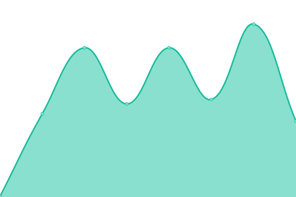

# [📈 Live Status](https://uptime.disrtuptiveinfotech.com): <!--live status--> **🟧 Partial outage**

This repository contains the open-source uptime monitor and status page for [Juan Fernando](https://uptime.disrtuptiveinfotech.com), powered by [Upptime](https://github.com/upptime/upptime).

With [Upptime](https://upptime.js.org), you can get your own unlimited and free uptime monitor and status page, powered entirely by a GitHub repository. We use [Issues](https://github.com/jfcatano/disruptive-uptime/issues) as incident reports, [Actions](https://github.com/jfcatano/disruptive-uptime/actions) as uptime monitors, and [Pages](https://uptime.disrtuptiveinfotech.com) for the status page.

<!--start: status pages-->
<!-- This summary is generated by Upptime (https://github.com/upptime/upptime) -->
<!-- Do not edit this manually, your changes will be overwritten -->
<!-- prettier-ignore -->
| URL | Status | History | Response Time | Uptime |
| --- | ------ | ------- | ------------- | ------ |
|  [Disruptive Website](https://www.disruptiveinfotech.com) | 🟥 Down | [disruptive-website.yml](https://github.com/jfcatano/disruptive-uptime/commits/HEAD/history/disruptive-website.yml) | 

 195ms
     
 | 

<a href="https://uptime.disruptiveinfotech.com/history/disruptive-website">0.00%</a>
    

|  [Liga Antioqueña de Rugby - API](https://apilarproject.disruptiveinfotech.com/) | 🟩 Up | [liga-antioquena-de-rugby-api.yml](https://github.com/jfcatano/disruptive-uptime/commits/HEAD/history/liga-antioquena-de-rugby-api.yml) | 

 204ms
     
 | 

<a href="https://uptime.disruptiveinfotech.com/history/liga-antioquena-de-rugby-api">100.00%</a>
    

|  [Liga Antioqueña de Rugby - Website](https://lar.disruptiveinfotech.com/) | 🟩 Up | [liga-antioquena-de-rugby-website.yml](https://github.com/jfcatano/disruptive-uptime/commits/HEAD/history/liga-antioquena-de-rugby-website.yml) | 

 189ms
     
 | 

<a href="https://uptime.disruptiveinfotech.com/history/liga-antioquena-de-rugby-website">100.00%</a>
    

|  [Mesadoko - API](https://apimesadoko.disruptiveinfotech.com/api/categories) | 🟩 Up | [mesadoko-api.yml](https://github.com/jfcatano/disruptive-uptime/commits/HEAD/history/mesadoko-api.yml) | 

 188ms
     
 | 

<a href="https://uptime.disruptiveinfotech.com/history/mesadoko-api">100.00%</a>
    

|  [Mesadoko - Website](https://mesadoko.com/) | 🟩 Up | [mesadoko-website.yml](https://github.com/jfcatano/disruptive-uptime/commits/HEAD/history/mesadoko-website.yml) | 

 287ms
     
 | 

<a href="https://uptime.disruptiveinfotech.com/history/mesadoko-website">100.00%</a>
    

<!--end: status pages-->

[**Visit our status website →**](https://uptime.disrtuptiveinfotech.com)

## 📄 License

- Powered by: [Upptime](https://github.com/upptime/upptime)
- Code: [MIT](./LICENSE) © [Anand Chowdhary](https://anandchowdhary.com), supported by [Pabio](https://pabio.com)
- Data in the `./history` directory: [Open Database License](https://opendatacommons.org/licenses/odbl/1-0/)
